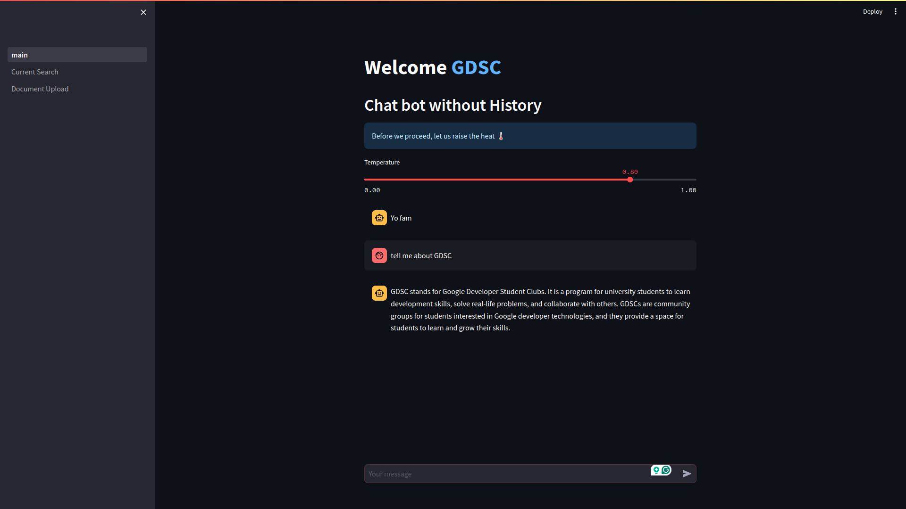
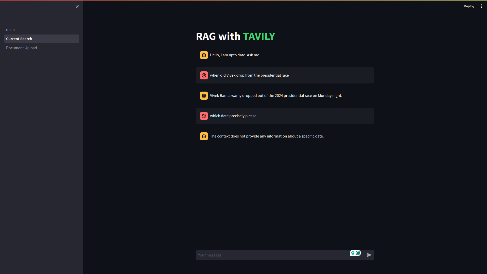
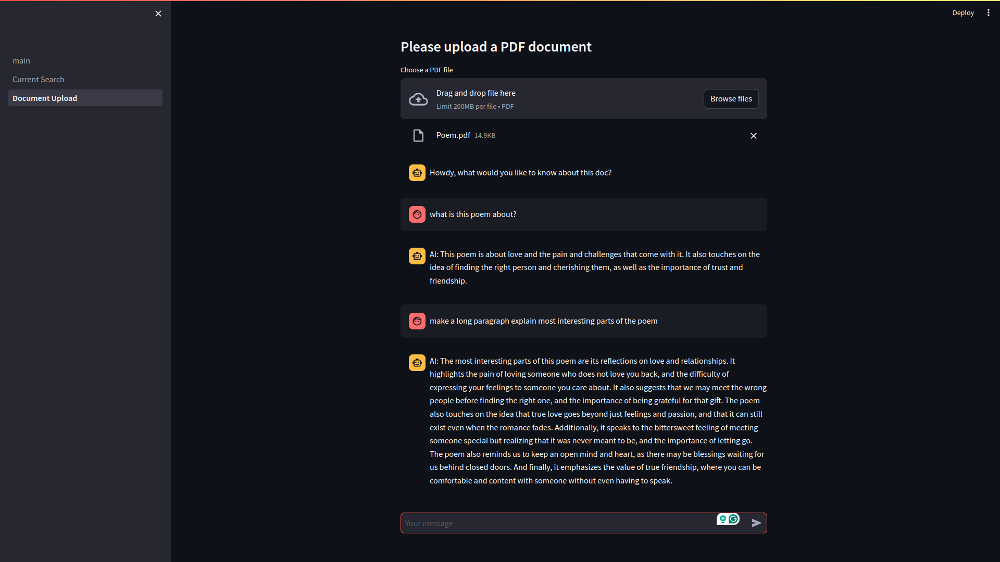

<h1> A GDSC Workshop on how how to build a Chat Bot</h1>
<h2> by Faye Kelmith  Organized GDSC Bamenda  </h2>

## Introduction

This project consist of 3 chatbots: - Simple Chatbot - Current Search Chatbot - Document Search Chatbot
I built them using the following technologies:

    <h2> Tech Stack : </h2>
    <ul style="list-style-type:none; align-items:center;">
        <li style=""> </img></li>
        <li> </li>
        <li style="font-size: 32px;"> 🦜️🔗 </li>
        <li> </li>   
        <li> </li>   
        <li> </li>   
        <li> </li>   
        <li style="margin:20px"><h2>Tavily AI</h2> </li>
        <li style="margin:20px"><h2>Chroma DB</h2> </li>     
    </ul>

<h2>Project Shots</h2>
    
    
    

## How to run project locally

- Clone the project
- Run `docker-compose up`
- Open your browser and navigate to `http://localhost:8501`

- To view your database, navigate to `http://localhost:8001`

> Note: You might need to install Docker and Docker Compose if you don't have them installed on your machine.

## Documentation

I wrote a blog post on how I built the chatbot. You can read it [here](https://monogr.ph/66212ffae6e6e6663a3f3f41)
Live Demo: [Chatbot](https://chatbot.fayekelmith.tech)
